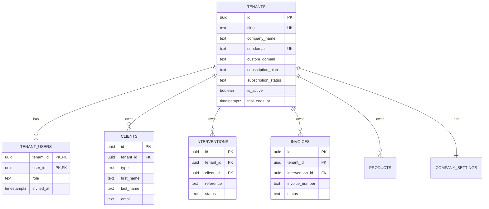

# 🚀 Plan de Transformation SaaS Multi-Tenant
## De Delmas-App vers Inter-App

**Version:** 1.0
**Date:** 2025-11-10
**Auteur:** Analyse technique automatisée
**Durée estimée:** 12-14 semaines
**Complexité:** 🔴 Élevée

---

## 📋 Table des Matières

1. [Vue d'ensemble](#vue-densemble)
2. [Objectifs](#objectifs)
3. [Architecture Cible](#architecture-cible)
4. [Phases de Transformation](#phases-de-transformation)
5. [Checklist de Migration](#checklist-de-migration)
6. [Risques et Mitigations](#risques-et-mitigations)
7. [Critères de Succès](#critères-de-succès)

---

## 🎯 Vue d'ensemble

### État Actuel
- **Application:** Delmas-App (mono-tenant)
- **Client unique:** Piscine Delmas
- **Architecture:** Next.js 14 + Supabase PostgreSQL
- **Isolation:** Aucune (schémas hardcodés)
- **Authentification:** 3 emails autorisés en dur

### État Cible
- **Application:** Inter-App (multi-tenant SaaS)
- **Clients multiples:** Illimité
- **Architecture:** Next.js 14 + Supabase + Multi-tenancy
- **Isolation:** Par tenant (colonne tenant_id)
- **Authentification:** Par organisation avec invitations

### Différences Clés

| Aspect | Delmas-App | Inter-App |
|--------|-----------|-----------|
| **Tenants** | 1 (Delmas) | Illimité |
| **Schémas DB** | `piscine_delmas_*` | `saas_*` ou génériques |
| **Isolation données** | ❌ Aucune | ✅ Par tenant_id |
| **Authentification** | 3 emails hardcodés | Système par organisation |
| **Branding** | Delmas fixe | White-label dynamique |
| **Configuration** | 1 ligne company_settings | Par tenant |
| **Numérotation factures** | Globale | Par tenant |
| **Domaines** | 1 seul | Subdomains + custom domains |
| **Facturation** | N/A | Plans + Stripe |
| **Onboarding** | Manuel | Wizard automatisé |

---

## 🎯 Objectifs

### Objectifs Fonctionnels

1. **Multi-tenancy complet**
   - Isolation totale des données par tenant
   - Sécurité RLS stricte
   - Tests d'isolation validés

2. **Onboarding automatisé**
   - Inscription self-service
   - Configuration guidée
   - Import CSV assisté

3. **White-label**
   - Logo personnalisé
   - Couleurs de marque
   - Domaines personnalisés

4. **Gestion des utilisateurs**
   - Invitations par email
   - Rôles (owner, admin, user, readonly)
   - Permissions granulaires

5. **Plans et facturation**
   - 3 plans (Starter, Pro, Enterprise)
   - Période d'essai 14 jours
   - Facturation Stripe

### Objectifs Techniques

1. **Refactoring complet**
   - 83 fichiers avec schémas hardcodés
   - Toutes les requêtes avec tenant_id
   - RLS policies par tenant

2. **Performance**
   - Index composites optimisés
   - Cache Redis pour settings
   - Lazy loading UI

3. **Scalabilité**
   - Support 1000+ tenants
   - Architecture stateless
   - Auto-scaling

4. **Sécurité**
   - Audit logs
   - Rate limiting par tenant
   - GDPR compliance

---

## 🏗️ Architecture Cible

### Modèle de Données Multi-Tenant



### Architecture Réseau

```
┌─────────────────────────────────────────────────────┐
│                   DNS Layer                          │
│  delmas.inter-app.com → Load Balancer              │
│  acme.inter-app.com → Load Balancer                │
│  custom-domain.com → Load Balancer                  │
└─────────────────────────────────────────────────────┘
                         │
                         ▼
┌─────────────────────────────────────────────────────┐
│               Next.js Application                    │
│  ┌─────────────────────────────────────────┐       │
│  │  Middleware: Tenant Detection           │       │
│  │  - Parse subdomain/domain               │       │
│  │  - Fetch tenant from DB                 │       │
│  │  - Inject tenant_id in context          │       │
│  │  - Check user access                    │       │
│  └─────────────────────────────────────────┘       │
│                                                      │
│  ┌─────────────────────────────────────────┐       │
│  │  React Context: TenantProvider          │       │
│  │  - Current tenant                        │       │
│  │  - Company settings                      │       │
│  │  - User role in tenant                   │       │
│  └─────────────────────────────────────────┘       │
└─────────────────────────────────────────────────────┘
                         │
                         ▼
┌─────────────────────────────────────────────────────┐
│               Supabase PostgreSQL                    │
│  ┌─────────────────────────────────────────┐       │
│  │  Schema: public                          │       │
│  │  - tenants (global)                      │       │
│  │  - tenant_users (global)                 │       │
│  └─────────────────────────────────────────┘       │
│                                                      │
│  ┌─────────────────────────────────────────┐       │
│  │  Schema: saas_public                     │       │
│  │  - clients (tenant_id)                   │       │
│  │  - interventions (tenant_id)             │       │
│  │  - products (tenant_id)                  │       │
│  │  - company_settings (tenant_id)          │       │
│  │  ... toutes les tables métier            │       │
│  └─────────────────────────────────────────┘       │
│                                                      │
│  ┌─────────────────────────────────────────┐       │
│  │  Schema: saas_compta                     │       │
│  │  - invoices (tenant_id)                  │       │
│  │  - invoice_items (tenant_id)             │       │
│  │  - invoice_number_sequences (tenant_id)  │       │
│  └─────────────────────────────────────────┘       │
│                                                      │
│  ┌─────────────────────────────────────────┐       │
│  │  RLS Policies (per table)                │       │
│  │  WHERE tenant_id = current_tenant()      │       │
│  └─────────────────────────────────────────┘       │
└─────────────────────────────────────────────────────┘
```

### Flux de Requête Multi-Tenant

```
1. User → https://acme.inter-app.com/dashboard/clients
                         │
                         ▼
2. Middleware: Extract subdomain "acme"
                         │
                         ▼
3. Middleware: SELECT * FROM tenants WHERE subdomain = 'acme'
                         │
                         ▼
4. Middleware: Check user in tenant_users
                         │
                         ▼
5. Middleware: Set tenant_id in headers
                         │
                         ▼
6. React: TenantProvider wraps app with tenant context
                         │
                         ▼
7. Component: const { tenant_id } = useTenant()
                         │
                         ▼
8. Query: SELECT * FROM clients WHERE tenant_id = :tenant_id
                         │
                         ▼
9. RLS Policy: Verify tenant_id matches user's tenant
                         │
                         ▼
10. Response: Only acme's clients returned
```

---

## 📅 Phases de Transformation

## Phase 1: Architecture de Base (2-3 semaines)

### Semaine 1: Setup Infrastructure

#### Jour 1-2: Tables Globales

```sql
-- Migration: 001_create_tenants_infrastructure.sql

-- Table tenants
CREATE TABLE public.tenants (
  id UUID PRIMARY KEY DEFAULT gen_random_uuid(),
  slug TEXT UNIQUE NOT NULL CHECK (slug ~ '^[a-z0-9-]+$'),

  -- Identification
  company_name TEXT NOT NULL,

  -- Domaines
  subdomain TEXT UNIQUE CHECK (subdomain ~ '^[a-z0-9-]+$'),
  custom_domain TEXT UNIQUE,

  -- Subscription
  subscription_plan TEXT NOT NULL DEFAULT 'starter'
    CHECK (subscription_plan IN ('starter', 'pro', 'enterprise', 'trial')),
  subscription_status TEXT NOT NULL DEFAULT 'trial'
    CHECK (subscription_status IN ('trial', 'active', 'suspended', 'cancelled')),

  -- Trial
  trial_ends_at TIMESTAMPTZ,
  trial_used BOOLEAN DEFAULT false,

  -- Billing
  stripe_customer_id TEXT UNIQUE,
  stripe_subscription_id TEXT,

  -- Status
  is_active BOOLEAN DEFAULT true,
  suspended_reason TEXT,
  suspended_at TIMESTAMPTZ,

  -- Metadata
  created_at TIMESTAMPTZ DEFAULT NOW(),
  updated_at TIMESTAMPTZ DEFAULT NOW(),
  created_by UUID REFERENCES auth.users(id),

  -- Search
  search_vector tsvector GENERATED ALWAYS AS (
    to_tsvector('french', coalesce(company_name, '') || ' ' || coalesce(slug, ''))
  ) STORED
);

CREATE INDEX idx_tenants_slug ON public.tenants(slug);
CREATE INDEX idx_tenants_subdomain ON public.tenants(subdomain);
CREATE INDEX idx_tenants_custom_domain ON public.tenants(custom_domain);
CREATE INDEX idx_tenants_subscription_status ON public.tenants(subscription_status);
CREATE INDEX idx_tenants_search ON public.tenants USING GIN(search_vector);

-- Table tenant_users
CREATE TABLE public.tenant_users (
  tenant_id UUID NOT NULL REFERENCES public.tenants(id) ON DELETE CASCADE,
  user_id UUID NOT NULL REFERENCES auth.users(id) ON DELETE CASCADE,

  -- Role
  role TEXT NOT NULL DEFAULT 'user'
    CHECK (role IN ('owner', 'admin', 'user', 'readonly')),

  -- Invitation
  invited_by UUID REFERENCES auth.users(id),
  invited_at TIMESTAMPTZ DEFAULT NOW(),
  invitation_accepted_at TIMESTAMPTZ,

  -- Status
  is_active BOOLEAN DEFAULT true,

  -- Metadata
  created_at TIMESTAMPTZ DEFAULT NOW(),
  updated_at TIMESTAMPTZ DEFAULT NOW(),

  PRIMARY KEY (tenant_id, user_id)
);

CREATE INDEX idx_tenant_users_user ON public.tenant_users(user_id);
CREATE INDEX idx_tenant_users_role ON public.tenant_users(tenant_id, role);

-- Table plan_limits
CREATE TABLE public.plan_limits (
  plan TEXT PRIMARY KEY CHECK (plan IN ('starter', 'pro', 'enterprise', 'trial')),

  -- Limits
  max_users INTEGER NOT NULL,
  max_clients INTEGER NOT NULL,
  max_interventions_per_month INTEGER NOT NULL,
  max_storage_gb INTEGER NOT NULL,
  max_products INTEGER NOT NULL,

  -- Features
  has_api_access BOOLEAN DEFAULT false,
  has_custom_domain BOOLEAN DEFAULT false,
  has_white_label BOOLEAN DEFAULT false,
  has_advanced_reports BOOLEAN DEFAULT false,
  has_priority_support BOOLEAN DEFAULT false,

  -- Pricing (cents)
  price_monthly_cents INTEGER NOT NULL,
  price_yearly_cents INTEGER NOT NULL,

  -- Metadata
  created_at TIMESTAMPTZ DEFAULT NOW(),
  updated_at TIMESTAMPTZ DEFAULT NOW()
);

-- Insert default limits
INSERT INTO public.plan_limits (plan, max_users, max_clients, max_interventions_per_month, max_storage_gb, max_products, has_api_access, has_custom_domain, has_white_label, has_advanced_reports, has_priority_support, price_monthly_cents, price_yearly_cents) VALUES
('trial', 1, 50, 100, 1, 100, false, false, false, false, false, 0, 0),
('starter', 2, 200, 500, 5, 500, false, false, false, false, false, 4900, 49000),
('pro', 10, 1000, 2000, 20, 2000, true, true, true, true, false, 9900, 99000),
('enterprise', 999, 999999, 999999, 100, 999999, true, true, true, true, true, 0, 0);

-- Fonction helper: get current tenant from headers
CREATE OR REPLACE FUNCTION public.current_tenant_id()
RETURNS UUID AS $$
  SELECT NULLIF(current_setting('app.current_tenant_id', true), '')::UUID;
$$ LANGUAGE SQL STABLE;

-- RLS pour tenants (lecture seule pour authenticated)
ALTER TABLE public.tenants ENABLE ROW LEVEL SECURITY;

CREATE POLICY "Users can view their own tenants"
  ON public.tenants
  FOR SELECT
  TO authenticated
  USING (
    id IN (
      SELECT tenant_id FROM public.tenant_users WHERE user_id = auth.uid()
    )
  );

-- RLS pour tenant_users
ALTER TABLE public.tenant_users ENABLE ROW LEVEL SECURITY;

CREATE POLICY "Users can view their own tenant memberships"
  ON public.tenant_users
  FOR SELECT
  TO authenticated
  USING (user_id = auth.uid());

CREATE POLICY "Tenant owners and admins can manage users"
  ON public.tenant_users
  FOR ALL
  TO authenticated
  USING (
    tenant_id IN (
      SELECT tenant_id
      FROM public.tenant_users
      WHERE user_id = auth.uid()
      AND role IN ('owner', 'admin')
    )
  );
```

**Tâches:**
- [ ] Créer migration SQL ci-dessus
- [ ] Appliquer sur DB de dev
- [ ] Tester création tenant
- [ ] Tester assignation utilisateur

#### Jour 3-5: Ajout tenant_id aux Tables Métier

```sql
-- Migration: 002_add_tenant_id_to_tables.sql

-- Liste des tables à modifier
DO $$
DECLARE
  tables TEXT[] := ARRAY[
    'clients',
    'interventions',
    'intervention_items',
    'intervention_types_junction',
    'pools',
    'pool_types',
    'products',
    'product_categories',
    'technicians',
    'profiles',
    'task_templates',
    'prospect_status',
    'pricing_config',
    'company_settings',
    'suppliers',
    'settings',
    'sync_metadata',
    'email_logs'
  ];
  t TEXT;
BEGIN
  FOREACH t IN ARRAY tables LOOP
    -- Ajouter colonne tenant_id (nullable d'abord)
    EXECUTE format('ALTER TABLE piscine_delmas_public.%I ADD COLUMN IF NOT EXISTS tenant_id UUID REFERENCES public.tenants(id) ON DELETE CASCADE', t);

    -- Créer index
    EXECUTE format('CREATE INDEX IF NOT EXISTS idx_%I_tenant ON piscine_delmas_public.%I(tenant_id)', t, t);

    RAISE NOTICE 'Added tenant_id to %', t;
  END LOOP;
END $$;

-- Tables comptabilité
ALTER TABLE piscine_delmas_compta.invoices
  ADD COLUMN IF NOT EXISTS tenant_id UUID REFERENCES public.tenants(id) ON DELETE CASCADE;
CREATE INDEX IF NOT EXISTS idx_invoices_tenant ON piscine_delmas_compta.invoices(tenant_id);

ALTER TABLE piscine_delmas_compta.invoice_items
  ADD COLUMN IF NOT EXISTS tenant_id UUID REFERENCES public.tenants(id) ON DELETE CASCADE;
CREATE INDEX IF NOT EXISTS idx_invoice_items_tenant ON piscine_delmas_compta.invoice_items(tenant_id);

ALTER TABLE piscine_delmas_compta.invoice_number_sequences
  ADD COLUMN IF NOT EXISTS tenant_id UUID REFERENCES public.tenants(id) ON DELETE CASCADE;
CREATE INDEX IF NOT EXISTS idx_invoice_number_sequences_tenant ON piscine_delmas_compta.invoice_number_sequences(tenant_id);

-- Modifier la clé primaire de invoice_number_sequences
ALTER TABLE piscine_delmas_compta.invoice_number_sequences
  DROP CONSTRAINT IF EXISTS invoice_number_sequences_pkey;
ALTER TABLE piscine_delmas_compta.invoice_number_sequences
  ADD PRIMARY KEY (tenant_id, year);
```

**Tâches:**
- [ ] Créer migration SQL ci-dessus
- [ ] Appliquer sur DB de dev
- [ ] Vérifier toutes les colonnes ajoutées
- [ ] Vérifier tous les index créés

#### Jour 6-7: Migration Données Delmas

```sql
-- Migration: 003_migrate_delmas_tenant.sql

-- Créer le tenant Delmas
INSERT INTO public.tenants (
  id,
  slug,
  company_name,
  subdomain,
  subscription_plan,
  subscription_status,
  is_active
) VALUES (
  gen_random_uuid(),
  'delmas',
  'PISCINE DELMAS',
  'delmas',
  'enterprise',  -- Plan gratuit pour client historique
  'active',
  true
) ON CONFLICT (slug) DO NOTHING
RETURNING id;

-- Stocker l'ID pour référence
DO $$
DECLARE
  delmas_tenant_id UUID;
BEGIN
  SELECT id INTO delmas_tenant_id FROM public.tenants WHERE slug = 'delmas';

  -- Migrer les 3 utilisateurs Delmas
  INSERT INTO public.tenant_users (tenant_id, user_id, role, invited_at, invitation_accepted_at)
  SELECT
    delmas_tenant_id,
    auth.users.id,
    'owner',
    NOW(),
    NOW()
  FROM auth.users
  WHERE email IN (
    'oppsyste@gmail.com',
    'stephanedelmas69@gmail.com',
    'christophemenoire@gmail.com'
  )
  ON CONFLICT (tenant_id, user_id) DO NOTHING;

  -- Migrer les données existantes vers le tenant Delmas
  -- Clients
  UPDATE piscine_delmas_public.clients
  SET tenant_id = delmas_tenant_id
  WHERE tenant_id IS NULL;

  -- Interventions
  UPDATE piscine_delmas_public.interventions
  SET tenant_id = delmas_tenant_id
  WHERE tenant_id IS NULL;

  -- Intervention items
  UPDATE piscine_delmas_public.intervention_items
  SET tenant_id = delmas_tenant_id
  WHERE tenant_id IS NULL;

  -- Intervention types junction
  UPDATE piscine_delmas_public.intervention_types_junction
  SET tenant_id = delmas_tenant_id
  WHERE tenant_id IS NULL;

  -- Pools
  UPDATE piscine_delmas_public.pools
  SET tenant_id = delmas_tenant_id
  WHERE tenant_id IS NULL;

  -- Pool types
  UPDATE piscine_delmas_public.pool_types
  SET tenant_id = delmas_tenant_id
  WHERE tenant_id IS NULL;

  -- Products
  UPDATE piscine_delmas_public.products
  SET tenant_id = delmas_tenant_id
  WHERE tenant_id IS NULL;

  -- Product categories
  UPDATE piscine_delmas_public.product_categories
  SET tenant_id = delmas_tenant_id
  WHERE tenant_id IS NULL;

  -- Technicians
  UPDATE piscine_delmas_public.technicians
  SET tenant_id = delmas_tenant_id
  WHERE tenant_id IS NULL;

  -- Profiles
  UPDATE piscine_delmas_public.profiles
  SET tenant_id = delmas_tenant_id
  WHERE tenant_id IS NULL;

  -- Task templates
  UPDATE piscine_delmas_public.task_templates
  SET tenant_id = delmas_tenant_id
  WHERE tenant_id IS NULL;

  -- Prospect status
  UPDATE piscine_delmas_public.prospect_status
  SET tenant_id = delmas_tenant_id
  WHERE tenant_id IS NULL;

  -- Pricing config
  UPDATE piscine_delmas_public.pricing_config
  SET tenant_id = delmas_tenant_id
  WHERE tenant_id IS NULL;

  -- Company settings
  UPDATE piscine_delmas_public.company_settings
  SET tenant_id = delmas_tenant_id
  WHERE tenant_id IS NULL;

  -- Suppliers
  UPDATE piscine_delmas_public.suppliers
  SET tenant_id = delmas_tenant_id
  WHERE tenant_id IS NULL;

  -- Settings
  UPDATE piscine_delmas_public.settings
  SET tenant_id = delmas_tenant_id
  WHERE tenant_id IS NULL;

  -- Sync metadata
  UPDATE piscine_delmas_public.sync_metadata
  SET tenant_id = delmas_tenant_id
  WHERE tenant_id IS NULL;

  -- Email logs
  UPDATE piscine_delmas_public.email_logs
  SET tenant_id = delmas_tenant_id
  WHERE tenant_id IS NULL;

  -- Invoices
  UPDATE piscine_delmas_compta.invoices
  SET tenant_id = delmas_tenant_id
  WHERE tenant_id IS NULL;

  -- Invoice items
  UPDATE piscine_delmas_compta.invoice_items
  SET tenant_id = delmas_tenant_id
  WHERE tenant_id IS NULL;

  -- Invoice number sequences
  UPDATE piscine_delmas_compta.invoice_number_sequences
  SET tenant_id = delmas_tenant_id
  WHERE tenant_id IS NULL;

  RAISE NOTICE 'Migration Delmas completed';
END $$;

-- Rendre tenant_id NOT NULL maintenant que toutes les données sont migrées
DO $$
DECLARE
  tables TEXT[] := ARRAY[
    'clients', 'interventions', 'intervention_items',
    'intervention_types_junction', 'pools', 'pool_types',
    'products', 'product_categories', 'technicians',
    'profiles', 'task_templates', 'prospect_status',
    'pricing_config', 'company_settings', 'suppliers',
    'settings', 'sync_metadata', 'email_logs'
  ];
  t TEXT;
BEGIN
  FOREACH t IN ARRAY tables LOOP
    EXECUTE format('ALTER TABLE piscine_delmas_public.%I ALTER COLUMN tenant_id SET NOT NULL', t);
    RAISE NOTICE 'Made tenant_id NOT NULL on %', t;
  END LOOP;
END $$;

ALTER TABLE piscine_delmas_compta.invoices ALTER COLUMN tenant_id SET NOT NULL;
ALTER TABLE piscine_delmas_compta.invoice_items ALTER COLUMN tenant_id SET NOT NULL;
ALTER TABLE piscine_delmas_compta.invoice_number_sequences ALTER COLUMN tenant_id SET NOT NULL;
```

**Tâches:**
- [ ] Backup complet de la DB avant migration
- [ ] Créer migration SQL ci-dessus
- [ ] Tester sur copie de DB en dev
- [ ] Vérifier aucune donnée perdue
- [ ] Appliquer sur DB de prod (avec fenêtre de maintenance)
- [ ] Vérifier tenant Delmas fonctionnel

### Semaine 2-3: RLS Policies Multi-Tenant

```sql
-- Migration: 004_create_tenant_rls_policies.sql

-- Fonction helper pour vérifier l'appartenance au tenant
CREATE OR REPLACE FUNCTION public.user_has_tenant_access(tenant_uuid UUID)
RETURNS BOOLEAN AS $$
  SELECT EXISTS (
    SELECT 1
    FROM public.tenant_users
    WHERE tenant_id = tenant_uuid
    AND user_id = auth.uid()
    AND is_active = true
  );
$$ LANGUAGE SQL STABLE SECURITY DEFINER;

-- Fonction helper pour obtenir les tenants de l'utilisateur
CREATE OR REPLACE FUNCTION public.user_tenant_ids()
RETURNS SETOF UUID AS $$
  SELECT tenant_id
  FROM public.tenant_users
  WHERE user_id = auth.uid()
  AND is_active = true;
$$ LANGUAGE SQL STABLE SECURITY DEFINER;

-- Macro pour créer les policies standard sur une table
CREATE OR REPLACE FUNCTION public.create_tenant_policies(
  schema_name TEXT,
  table_name TEXT
) RETURNS void AS $$
BEGIN
  -- Enable RLS
  EXECUTE format('ALTER TABLE %I.%I ENABLE ROW LEVEL SECURITY', schema_name, table_name);

  -- Policy: SELECT
  EXECUTE format('
    CREATE POLICY "tenant_isolation_select" ON %I.%I
    FOR SELECT TO authenticated
    USING (tenant_id IN (SELECT public.user_tenant_ids()))
  ', schema_name, table_name);

  -- Policy: INSERT
  EXECUTE format('
    CREATE POLICY "tenant_isolation_insert" ON %I.%I
    FOR INSERT TO authenticated
    WITH CHECK (tenant_id IN (SELECT public.user_tenant_ids()))
  ', schema_name, table_name);

  -- Policy: UPDATE
  EXECUTE format('
    CREATE POLICY "tenant_isolation_update" ON %I.%I
    FOR UPDATE TO authenticated
    USING (tenant_id IN (SELECT public.user_tenant_ids()))
    WITH CHECK (tenant_id IN (SELECT public.user_tenant_ids()))
  ', schema_name, table_name);

  -- Policy: DELETE
  EXECUTE format('
    CREATE POLICY "tenant_isolation_delete" ON %I.%I
    FOR DELETE TO authenticated
    USING (tenant_id IN (SELECT public.user_tenant_ids()))
  ', schema_name, table_name);

  RAISE NOTICE 'Created tenant policies for %.%', schema_name, table_name;
END;
$$ LANGUAGE plpgsql;

-- Appliquer les policies sur toutes les tables métier
SELECT public.create_tenant_policies('piscine_delmas_public', 'clients');
SELECT public.create_tenant_policies('piscine_delmas_public', 'interventions');
SELECT public.create_tenant_policies('piscine_delmas_public', 'intervention_items');
SELECT public.create_tenant_policies('piscine_delmas_public', 'intervention_types_junction');
SELECT public.create_tenant_policies('piscine_delmas_public', 'pools');
SELECT public.create_tenant_policies('piscine_delmas_public', 'pool_types');
SELECT public.create_tenant_policies('piscine_delmas_public', 'products');
SELECT public.create_tenant_policies('piscine_delmas_public', 'product_categories');
SELECT public.create_tenant_policies('piscine_delmas_public', 'technicians');
SELECT public.create_tenant_policies('piscine_delmas_public', 'profiles');
SELECT public.create_tenant_policies('piscine_delmas_public', 'task_templates');
SELECT public.create_tenant_policies('piscine_delmas_public', 'prospect_status');
SELECT public.create_tenant_policies('piscine_delmas_public', 'pricing_config');
SELECT public.create_tenant_policies('piscine_delmas_public', 'company_settings');
SELECT public.create_tenant_policies('piscine_delmas_public', 'suppliers');
SELECT public.create_tenant_policies('piscine_delmas_public', 'settings');
SELECT public.create_tenant_policies('piscine_delmas_public', 'sync_metadata');
SELECT public.create_tenant_policies('piscine_delmas_public', 'email_logs');

-- Tables comptabilité
SELECT public.create_tenant_policies('piscine_delmas_compta', 'invoices');
SELECT public.create_tenant_policies('piscine_delmas_compta', 'invoice_items');
SELECT public.create_tenant_policies('piscine_delmas_compta', 'invoice_number_sequences');
```

**Tâches:**
- [ ] Créer migration SQL ci-dessus
- [ ] Appliquer sur DB de dev
- [ ] Tester isolation entre 2 tenants test
- [ ] Vérifier qu'un user ne peut pas voir les données d'un autre tenant
- [ ] Tester avec différents rôles

**✅ Fin Phase 1**

---

## Phase 2: Isolation et Sécurité (2 semaines)

### Semaine 4: Middleware et Contexte

#### Modification Middleware

**Fichier:** `/middleware.ts`

```typescript
import { createServerClient } from '@supabase/ssr'
import { NextResponse, type NextRequest } from 'next/server'

// Types
interface Tenant {
  id: string
  slug: string
  company_name: string
  subdomain: string | null
  custom_domain: string | null
  subscription_status: string
  is_active: boolean
}

interface TenantUser {
  tenant_id: string
  user_id: string
  role: string
  is_active: boolean
}

/**
 * Extrait le tenant depuis le hostname
 */
async function getTenantFromRequest(
  request: NextRequest,
  supabase: any
): Promise<Tenant | null> {
  const host = request.headers.get('host') || ''

  // En développement local
  if (host.includes('localhost') || host.includes('127.0.0.1')) {
    // Chercher dans les query params: ?tenant=delmas
    const url = new URL(request.url)
    const tenantSlug = url.searchParams.get('tenant')

    if (tenantSlug) {
      const { data } = await supabase
        .from('tenants')
        .select('*')
        .eq('slug', tenantSlug)
        .eq('is_active', true)
        .single()

      return data
    }

    // Par défaut en dev: delmas
    const { data } = await supabase
      .from('tenants')
      .select('*')
      .eq('slug', 'delmas')
      .eq('is_active', true)
      .single()

    return data
  }

  // En production: chercher par subdomain ou custom domain
  const parts = host.split('.')

  // Custom domain: acme.com
  if (parts.length === 2 || (parts.length === 3 && parts[0] === 'www')) {
    const domain = parts.length === 3 ? parts.slice(1).join('.') : host
    const { data } = await supabase
      .from('tenants')
      .select('*')
      .eq('custom_domain', domain)
      .eq('is_active', true)
      .single()

    if (data) return data
  }

  // Subdomain: acme.inter-app.com
  if (parts.length >= 3) {
    const subdomain = parts[0]

    // Ignorer les subdomains système
    if (['www', 'app', 'api', 'admin'].includes(subdomain)) {
      return null
    }

    const { data } = await supabase
      .from('tenants')
      .select('*')
      .eq('subdomain', subdomain)
      .eq('is_active', true)
      .single()

    return data
  }

  return null
}

/**
 * Vérifie si l'utilisateur a accès au tenant
 */
async function checkTenantAccess(
  tenantId: string,
  userId: string,
  supabase: any
): Promise<TenantUser | null> {
  const { data } = await supabase
    .from('tenant_users')
    .select('*')
    .eq('tenant_id', tenantId)
    .eq('user_id', userId)
    .eq('is_active', true)
    .single()

  return data
}

export async function middleware(request: NextRequest) {
  let response = NextResponse.next({
    request: {
      headers: request.headers,
    },
  })

  const supabase = createServerClient(
    process.env.NEXT_PUBLIC_SUPABASE_URL!,
    process.env.NEXT_PUBLIC_SUPABASE_ANON_KEY!,
    {
      cookies: {
        get(name: string) {
          return request.cookies.get(name)?.value
        },
        set(name: string, value: string, options: any) {
          request.cookies.set({ name, value, ...options })
          response = NextResponse.next({
            request: { headers: request.headers },
          })
          response.cookies.set({ name, value, ...options })
        },
        remove(name: string, options: any) {
          request.cookies.set({ name, value: '', ...options })
          response = NextResponse.next({
            request: { headers: request.headers },
          })
          response.cookies.set({ name, value: '', ...options })
        },
      },
    }
  )

  // Rafraîchir la session
  const { data: { user } } = await supabase.auth.getUser()

  // Pages publiques (pas besoin de tenant)
  const publicPaths = ['/login', '/signup', '/reset-password', '/unauthorized', '/tenant-not-found']
  if (publicPaths.some(path => request.nextUrl.pathname.startsWith(path))) {
    return response
  }

  // Rediriger vers login si non authentifié
  if (!user && request.nextUrl.pathname.startsWith('/dashboard')) {
    return NextResponse.redirect(new URL('/login', request.url))
  }

  // Si authentifié, vérifier le tenant
  if (user) {
    const tenant = await getTenantFromRequest(request, supabase)

    if (!tenant) {
      console.error('Tenant not found for host:', request.headers.get('host'))
      return NextResponse.redirect(new URL('/tenant-not-found', request.url))
    }

    // Vérifier que l'utilisateur a accès à ce tenant
    const tenantUser = await checkTenantAccess(tenant.id, user.id, supabase)

    if (!tenantUser) {
      console.error('User does not have access to tenant:', tenant.slug)
      return NextResponse.redirect(new URL('/unauthorized', request.url))
    }

    // Vérifier le statut de la subscription
    if (tenant.subscription_status === 'suspended') {
      return NextResponse.redirect(new URL('/subscription-suspended', request.url))
    }

    // Injecter les infos du tenant dans les headers
    response.headers.set('x-tenant-id', tenant.id)
    response.headers.set('x-tenant-slug', tenant.slug)
    response.headers.set('x-tenant-role', tenantUser.role)
  }

  return response
}

export const config = {
  matcher: [
    '/((?!_next/static|_next/image|favicon.ico|.*\\.(?:svg|png|jpg|jpeg|gif|webp)$).*)',
  ],
}
```

**Tâches:**
- [ ] Remplacer le middleware actuel
- [ ] Créer pages `/tenant-not-found` et `/subscription-suspended`
- [ ] Tester avec subdomain delmas.localhost (avec /etc/hosts)
- [ ] Tester accès refusé avec utilisateur non autorisé

#### Context Provider React

**Fichier:** `/lib/contexts/TenantContext.tsx`

```typescript
'use client'

import { createContext, useContext, useEffect, useState } from 'react'
import { createClient } from '@/lib/supabase/client'

interface Tenant {
  id: string
  slug: string
  company_name: string
  subdomain: string | null
  subscription_plan: string
  subscription_status: string
}

interface CompanySettings {
  company_name: string
  company_address: string
  company_postal_code: string
  company_city: string
  email: string
  phone: string
  logo_url: string | null
  primary_color: string
  siret: string
  tva_number: string
  invoice_prefix: string
  // ... autres champs
}

interface TenantContextValue {
  tenant: Tenant | null
  companySettings: CompanySettings | null
  userRole: string | null
  isLoading: boolean
  refreshTenant: () => Promise<void>
  refreshCompanySettings: () => Promise<void>
}

const TenantContext = createContext<TenantContextValue | undefined>(undefined)

export function TenantProvider({ children }: { children: React.ReactNode }) {
  const [tenant, setTenant] = useState<Tenant | null>(null)
  const [companySettings, setCompanySettings] = useState<CompanySettings | null>(null)
  const [userRole, setUserRole] = useState<string | null>(null)
  const [isLoading, setIsLoading] = useState(true)

  const supabase = createClient()

  async function fetchTenant() {
    try {
      setIsLoading(true)

      // Obtenir le tenant depuis les headers (injectés par middleware)
      const response = await fetch('/api/tenant/current')
      const data = await response.json()

      if (data.tenant) {
        setTenant(data.tenant)
        setUserRole(data.userRole)
      }
    } catch (error) {
      console.error('Error fetching tenant:', error)
    } finally {
      setIsLoading(false)
    }
  }

  async function fetchCompanySettings() {
    if (!tenant) return

    try {
      const { data } = await supabase
        .schema('piscine_delmas_public')
        .from('company_settings')
        .select('*')
        .eq('tenant_id', tenant.id)
        .single()

      if (data) {
        setCompanySettings(data)
      }
    } catch (error) {
      console.error('Error fetching company settings:', error)
    }
  }

  useEffect(() => {
    fetchTenant()
  }, [])

  useEffect(() => {
    if (tenant) {
      fetchCompanySettings()
    }
  }, [tenant])

  return (
    <TenantContext.Provider
      value={{
        tenant,
        companySettings,
        userRole,
        isLoading,
        refreshTenant: fetchTenant,
        refreshCompanySettings: fetchCompanySettings,
      }}
    >
      {children}
    </TenantContext.Provider>
  )
}

export function useTenant() {
  const context = useContext(TenantContext)
  if (context === undefined) {
    throw new Error('useTenant must be used within a TenantProvider')
  }
  return context
}
```

**Fichier:** `/app/api/tenant/current/route.ts`

```typescript
import { createServerClient } from '@/lib/supabase/server'
import { NextRequest, NextResponse } from 'next/server'

export async function GET(request: NextRequest) {
  const tenantId = request.headers.get('x-tenant-id')
  const tenantSlug = request.headers.get('x-tenant-slug')
  const userRole = request.headers.get('x-tenant-role')

  if (!tenantId) {
    return NextResponse.json({ error: 'No tenant found' }, { status: 404 })
  }

  const supabase = createServerClient()

  const { data: tenant } = await supabase
    .from('tenants')
    .select('*')
    .eq('id', tenantId)
    .single()

  return NextResponse.json({
    tenant,
    userRole,
  })
}
```

**Tâches:**
- [ ] Créer le TenantContext
- [ ] Créer l'API route `/api/tenant/current`
- [ ] Wrapper l'app avec TenantProvider dans le layout
- [ ] Tester useTenant() dans composants

### Semaine 5: Tests d'Isolation

#### Script de Test d'Isolation

**Fichier:** `/tests/tenant-isolation.test.ts`

```typescript
import { createClient } from '@supabase/supabase-js'

describe('Tenant Isolation Tests', () => {
  let supabaseTenant1: any
  let supabaseTenant2: any
  let tenant1Id: string
  let tenant2Id: string

  beforeAll(async () => {
    // Créer 2 tenants de test
    const adminClient = createClient(
      process.env.NEXT_PUBLIC_SUPABASE_URL!,
      process.env.SUPABASE_SERVICE_ROLE_KEY! // Service role pour bypass RLS
    )

    // Tenant 1
    const { data: t1 } = await adminClient
      .from('tenants')
      .insert({
        slug: 'test-tenant-1',
        company_name: 'Test Company 1',
        subdomain: 'test1',
      })
      .select()
      .single()
    tenant1Id = t1.id

    // Tenant 2
    const { data: t2 } = await adminClient
      .from('tenants')
      .insert({
        slug: 'test-tenant-2',
        company_name: 'Test Company 2',
        subdomain: 'test2',
      })
      .select()
      .single()
    tenant2Id = t2.id

    // Créer utilisateurs et les assigner
    // ... créer auth.users et tenant_users
  })

  test('User from tenant1 cannot see tenant2 clients', async () => {
    // Se connecter en tant que user tenant1
    await supabaseTenant1.auth.signInWithPassword({
      email: 'user1@test.com',
      password: 'password',
    })

    // Créer un client pour tenant2 (avec service role)
    const adminClient = createClient(
      process.env.NEXT_PUBLIC_SUPABASE_URL!,
      process.env.SUPABASE_SERVICE_ROLE_KEY!
    )
    await adminClient.schema('piscine_delmas_public').from('clients').insert({
      tenant_id: tenant2Id,
      type: 'particulier',
      first_name: 'Secret',
      last_name: 'Client',
    })

    // Essayer de lire les clients en tant que user tenant1
    const { data, error } = await supabaseTenant1
      .schema('piscine_delmas_public')
      .from('clients')
      .select('*')

    // Ne devrait voir aucun client de tenant2
    expect(data).not.toContainEqual(
      expect.objectContaining({ tenant_id: tenant2Id })
    )
  })

  test('User cannot insert data for another tenant', async () => {
    await supabaseTenant1.auth.signInWithPassword({
      email: 'user1@test.com',
      password: 'password',
    })

    // Essayer d'insérer un client pour tenant2
    const { data, error } = await supabaseTenant1
      .schema('piscine_delmas_public')
      .from('clients')
      .insert({
        tenant_id: tenant2Id, // ⚠️ Pas le bon tenant!
        type: 'particulier',
        first_name: 'Malicious',
        last_name: 'Insert',
      })

    // Devrait échouer
    expect(error).not.toBeNull()
    expect(error?.message).toContain('policy')
  })

  // Autres tests...
})
```

**Tâches:**
- [ ] Créer la suite de tests d'isolation
- [ ] Tester SELECT entre tenants
- [ ] Tester INSERT avec mauvais tenant_id
- [ ] Tester UPDATE inter-tenant
- [ ] Tester DELETE inter-tenant
- [ ] Tous les tests doivent passer ✅

**✅ Fin Phase 2**

---

## Phase 3: Refactoring du Code (3-4 semaines)

### Semaine 6-7: Refactoring Server Actions

**Stratégie:**
1. Créer un helper pour obtenir le tenant_id actuel
2. Modifier toutes les requêtes pour inclure `.eq('tenant_id', tenantId)`
3. Lors des INSERT, toujours inclure `tenant_id`

**Fichier:** `/lib/helpers/tenant.ts`

```typescript
import { createServerClient } from '@/lib/supabase/server'
import { headers } from 'next/headers'

/**
 * Obtient le tenant ID depuis les headers (injectés par middleware)
 */
export async function getCurrentTenantId(): Promise<string> {
  const headersList = headers()
  const tenantId = headersList.get('x-tenant-id')

  if (!tenantId) {
    throw new Error('Tenant ID not found in headers. Middleware may not be configured correctly.')
  }

  return tenantId
}

/**
 * Obtient le rôle de l'utilisateur dans le tenant actuel
 */
export async function getCurrentUserRole(): Promise<string> {
  const headersList = headers()
  const role = headersList.get('x-tenant-role')

  if (!role) {
    throw new Error('User role not found in headers.')
  }

  return role
}

/**
 * Vérifie si l'utilisateur a un rôle spécifique
 */
export async function requireRole(requiredRole: string | string[]) {
  const role = await getCurrentUserRole()
  const roles = Array.isArray(requiredRole) ? requiredRole : [requiredRole]

  if (!roles.includes(role)) {
    throw new Error(`Unauthorized. Required role: ${roles.join(' or ')}`)
  }
}
```

**Exemple de refactoring:** `/lib/actions/clients.ts`

```typescript
// AVANT
export async function getClients() {
  'use server'

  const supabase = createServerClient()

  const { data, error } = await supabase
    .schema('piscine_delmas_public')
    .from('clients')
    .select('*')
    .order('created_at', { ascending: false })

  if (error) throw error
  return data
}

// APRÈS
import { getCurrentTenantId } from '@/lib/helpers/tenant'

export async function getClients() {
  'use server'

  const supabase = createServerClient()
  const tenantId = await getCurrentTenantId()

  const { data, error } = await supabase
    .schema('piscine_delmas_public')
    .from('clients')
    .select('*')
    .eq('tenant_id', tenantId) // ✅ Ajouté
    .order('created_at', { ascending: false })

  if (error) throw error
  return data
}

export async function getClient(id: string) {
  'use server'

  const supabase = createServerClient()
  const tenantId = await getCurrentTenantId()

  const { data, error } = await supabase
    .schema('piscine_delmas_public')
    .from('clients')
    .select('*')
    .eq('id', id)
    .eq('tenant_id', tenantId) // ✅ Ajouté
    .single()

  if (error) throw error
  return data
}

export async function createClient(clientData: any) {
  'use server'

  const supabase = createServerClient()
  const tenantId = await getCurrentTenantId()

  const { data, error } = await supabase
    .schema('piscine_delmas_public')
    .from('clients')
    .insert({
      ...clientData,
      tenant_id: tenantId, // ✅ Ajouté
    })
    .select()
    .single()

  if (error) throw error
  return data
}
```

**Fichiers à refactorer (6 fichiers):**
- [ ] `/lib/actions/clients.ts`
- [ ] `/lib/actions/interventions.ts`
- [ ] `/lib/actions/invoices.ts`
- [ ] `/lib/actions/company-settings.ts`
- [ ] `/lib/actions/stats.ts`
- [ ] `/lib/actions/products.ts` (s'il existe)

### Semaine 8: Refactoring API Routes

**Exemple:** `/app/api/interventions/[id]/send-to-client/route.ts`

```typescript
// AVANT
export async function POST(
  request: Request,
  { params }: { params: { id: string } }
) {
  const supabase = createServerClient()

  const { data: intervention } = await supabase
    .schema('piscine_delmas_public')
    .from('interventions')
    .select('*, clients(*)')
    .eq('id', params.id)
    .single()

  // ... reste du code
}

// APRÈS
import { getCurrentTenantId } from '@/lib/helpers/tenant'

export async function POST(
  request: Request,
  { params }: { params: { id: string } }
) {
  const supabase = createServerClient()
  const tenantId = await getCurrentTenantId()

  const { data: intervention } = await supabase
    .schema('piscine_delmas_public')
    .from('interventions')
    .select('*, clients(*)')
    .eq('id', params.id)
    .eq('tenant_id', tenantId) // ✅ Ajouté
    .single()

  // Vérifier que le client appartient aussi au tenant
  if (intervention.clients.tenant_id !== tenantId) {
    return NextResponse.json({ error: 'Unauthorized' }, { status: 403 })
  }

  // ... reste du code
}
```

**API Routes à refactorer (~10 routes):**
- [ ] `/app/api/interventions/[id]/send-to-client/route.ts`
- [ ] `/app/api/interventions/[id]/send-confirmation/route.ts`
- [ ] `/app/api/interventions/[id]/create-invoice/route.ts`
- [ ] `/app/api/invoices/[id]/send/route.ts`
- [ ] `/app/api/calendar/import-event/route.ts`
- [ ] Toutes les autres routes API

### Semaine 9: Refactoring Composants React

**Stratégie:**
1. Utiliser `useTenant()` pour obtenir le tenant
2. Afficher les données du tenant dynamiquement (branding)
3. Pas besoin de modifier les appels aux server actions (déjà refactorées)

**Exemple:** `/app/dashboard/layout.tsx`

```typescript
// AVANT
<header>
  <h1>Delmas Piscine</h1>
  <p>Gestion d'interventions</p>
</header>

// APRÈS
'use client'

import { useTenant } from '@/lib/contexts/TenantContext'

export default function DashboardLayout({ children }) {
  const { companySettings, isLoading } = useTenant()

  if (isLoading) return <LoadingSpinner />

  return (
    <div>
      <header style={{ backgroundColor: companySettings?.primary_color }}>
        {companySettings?.logo_url && (
          
        )}
        <h1>{companySettings?.company_name}</h1>
        <p>Gestion d'interventions</p>
      </header>

      {children}
    </div>
  )
}
```

**Composants à refactorer (~40 composants):**
- [ ] `/app/dashboard/layout.tsx` - Header avec nom entreprise
- [ ] `/app/components/invoices/*` - PDF avec company_settings
- [ ] `/app/login/page.tsx` - Logo du tenant
- [ ] Tous les composants affichant des infos "Delmas"

**✅ Fin Phase 3**

---

## Phase 4: Fonctionnalités SaaS (3 semaines)

### Semaine 10: Inscription et Onboarding

#### Page d'inscription

**Fichier:** `/app/signup/page.tsx`

```typescript
'use client'

import { useState } from 'react'
import { useRouter } from 'next/navigation'
import { createClient } from '@/lib/supabase/client'

export default function SignupPage() {
  const [step, setStep] = useState(1)
  const [formData, setFormData] = useState({
    // Step 1: Account
    email: '',
    password: '',
    firstName: '',
    lastName: '',

    // Step 2: Company
    companyName: '',
    slug: '',
    industry: 'pool_maintenance', // ou autre

    // Step 3: Plan
    plan: 'starter',
  })

  const router = useRouter()
  const supabase = createClient()

  async function handleSubmit() {
    try {
      // 1. Créer l'utilisateur
      const { data: authData, error: authError } = await supabase.auth.signUp({
        email: formData.email,
        password: formData.password,
        options: {
          data: {
            first_name: formData.firstName,
            last_name: formData.lastName,
          },
        },
      })

      if (authError) throw authError

      // 2. Créer le tenant (via API)
      const response = await fetch('/api/tenants/create', {
        method: 'POST',
        headers: { 'Content-Type': 'application/json' },
        body: JSON.stringify({
          company_name: formData.companyName,
          slug: formData.slug,
          subscription_plan: formData.plan,
          owner_user_id: authData.user!.id,
        }),
      })

      const { tenant } = await response.json()

      // 3. Rediriger vers le subdomain du nouveau tenant
      const tenantUrl = `https://${tenant.subdomain}.inter-app.com/onboarding`
      router.push(tenantUrl)

    } catch (error) {
      console.error('Signup error:', error)
      // Afficher erreur
    }
  }

  return (
    <div className="signup-wizard">
      {step === 1 && <AccountStep />}
      {step === 2 && <CompanyStep />}
      {step === 3 && <PlanStep />}
      {step === 4 && <ConfirmationStep onSubmit={handleSubmit} />}
    </div>
  )
}
```

**Fichier:** `/app/api/tenants/create/route.ts`

```typescript
import { createServerClient } from '@/lib/supabase/server'
import { NextResponse } from 'next/server'

export async function POST(request: Request) {
  const supabase = createServerClient()

  const { company_name, slug, subscription_plan, owner_user_id } = await request.json()

  // Vérifier que le slug est disponible
  const { data: existing } = await supabase
    .from('tenants')
    .select('id')
    .eq('slug', slug)
    .single()

  if (existing) {
    return NextResponse.json(
      { error: 'Slug already taken' },
      { status: 400 }
    )
  }

  // Créer le tenant
  const { data: tenant, error: tenantError } = await supabase
    .from('tenants')
    .insert({
      slug,
      company_name,
      subdomain: slug,
      subscription_plan,
      subscription_status: 'trial',
      trial_ends_at: new Date(Date.now() + 14 * 24 * 60 * 60 * 1000), // 14 jours
      is_active: true,
    })
    .select()
    .single()

  if (tenantError) throw tenantError

  // Assigner l'utilisateur comme owner
  const { error: userError } = await supabase
    .from('tenant_users')
    .insert({
      tenant_id: tenant.id,
      user_id: owner_user_id,
      role: 'owner',
      is_active: true,
    })

  if (userError) throw userError

  // Créer les company_settings par défaut
  const { error: settingsError } = await supabase
    .schema('piscine_delmas_public')
    .from('company_settings')
    .insert({
      tenant_id: tenant.id,
      company_name,
      email: '', // À compléter par l'utilisateur
      phone: '',
      invoice_prefix: 'INV',
      primary_color: '#3b82f6',
    })

  if (settingsError) throw settingsError

  // Créer les données de base (catégories, statuts, etc.)
  await initializeTenantDefaults(tenant.id, supabase)

  return NextResponse.json({ tenant })
}

async function initializeTenantDefaults(tenantId: string, supabase: any) {
  // Catégories de produits par défaut
  await supabase.schema('piscine_delmas_public').from('product_categories').insert([
    { tenant_id: tenantId, name: 'Produits chimiques', description: 'Chlore, pH, etc.' },
    { tenant_id: tenantId, name: 'Équipements', description: 'Filtres, pompes, etc.' },
    { tenant_id: tenantId, name: 'Accessoires', description: 'Épuisettes, brosses, etc.' },
  ])

  // Statuts prospects par défaut
  await supabase.schema('piscine_delmas_public').from('prospect_status').insert([
    { tenant_id: tenantId, name: 'Nouveau', order: 1, color: '#3b82f6' },
    { tenant_id: tenantId, name: 'Contact établi', order: 2, color: '#8b5cf6' },
    { tenant_id: tenantId, name: 'Devis envoyé', order: 3, color: '#f59e0b' },
    { tenant_id: tenantId, name: 'Gagné', order: 4, color: '#10b981' },
    { tenant_id: tenantId, name: 'Perdu', order: 5, color: '#ef4444' },
  ])

  // Pool types par défaut
  await supabase.schema('piscine_delmas_public').from('pool_types').insert([
    { tenant_id: tenantId, name: 'Enterrée', description: 'Piscine enterrée' },
    { tenant_id: tenantId, name: 'Hors-sol', description: 'Piscine hors-sol' },
    { tenant_id: tenantId, name: 'Semi-enterrée', description: 'Piscine semi-enterrée' },
  ])
}
```

**Tâches:**
- [ ] Créer la page `/signup`
- [ ] Créer l'API `/api/tenants/create`
- [ ] Créer le wizard d'onboarding
- [ ] Tester création tenant complet
- [ ] Vérifier données par défaut créées

### Semaine 11: Gestion des Utilisateurs

**Fichier:** `/app/dashboard/settings/users/page.tsx`

```typescript
'use client'

import { useState, useEffect } from 'react'
import { useTenant } from '@/lib/contexts/TenantContext'

export default function UsersSettingsPage() {
  const { tenant, userRole } = useTenant()
  const [users, setUsers] = useState([])
  const [inviteEmail, setInviteEmail] = useState('')
  const [inviteRole, setInviteRole] = useState('user')

  useEffect(() => {
    fetchUsers()
  }, [])

  async function fetchUsers() {
    const response = await fetch('/api/tenant/users')
    const data = await response.json()
    setUsers(data.users)
  }

  async function handleInvite() {
    await fetch('/api/tenant/users/invite', {
      method: 'POST',
      headers: { 'Content-Type': 'application/json' },
      body: JSON.stringify({
        email: inviteEmail,
        role: inviteRole,
      }),
    })

    await fetchUsers()
    setInviteEmail('')
  }

  async function handleRoleChange(userId: string, newRole: string) {
    await fetch(`/api/tenant/users/${userId}`, {
      method: 'PATCH',
      headers: { 'Content-Type': 'application/json' },
      body: JSON.stringify({ role: newRole }),
    })

    await fetchUsers()
  }

  async function handleRemoveUser(userId: string) {
    if (!confirm('Êtes-vous sûr de vouloir retirer cet utilisateur ?')) return

    await fetch(`/api/tenant/users/${userId}`, {
      method: 'DELETE',
    })

    await fetchUsers()
  }

  // Seuls les owners et admins peuvent gérer les utilisateurs
  if (!['owner', 'admin'].includes(userRole || '')) {
    return <div>Accès refusé</div>
  }

  return (
    <div className="users-settings">
      <h1>Gestion des utilisateurs</h1>

      {/* Formulaire d'invitation */}
      <div className="invite-form">
        <h2>Inviter un utilisateur</h2>
        <input
          type="email"
          placeholder="Email"
          value={inviteEmail}
          onChange={(e) => setInviteEmail(e.target.value)}
        />
        <select value={inviteRole} onChange={(e) => setInviteRole(e.target.value)}>
          <option value="readonly">Lecture seule</option>
          <option value="user">Utilisateur</option>
          <option value="admin">Administrateur</option>
        </select>
        <button onClick={handleInvite}>Envoyer l'invitation</button>
      </div>

      {/* Liste des utilisateurs */}
      <div className="users-list">
        <h2>Utilisateurs</h2>
        <table>
          <thead>
            <tr>
              <th>Email</th>
              <th>Nom</th>
              <th>Rôle</th>
              <th>Statut</th>
              <th>Actions</th>
            </tr>
          </thead>
          <tbody>
            {users.map((user: any) => (
              <tr key={user.user_id}>
                <td>{user.email}</td>
                <td>{user.full_name}</td>
                <td>
                  <select
                    value={user.role}
                    onChange={(e) => handleRoleChange(user.user_id, e.target.value)}
                    disabled={user.role === 'owner' && userRole !== 'owner'}
                  >
                    <option value="readonly">Lecture seule</option>
                    <option value="user">Utilisateur</option>
                    <option value="admin">Administrateur</option>
                    {user.role === 'owner' && <option value="owner">Propriétaire</option>}
                  </select>
                </td>
                <td>
                  {user.is_active ? (
                    <span className="badge-success">Actif</span>
                  ) : (
                    <span className="badge-warning">Invitation en attente</span>
                  )}
                </td>
                <td>
                  {user.role !== 'owner' && (
                    <button
                      onClick={() => handleRemoveUser(user.user_id)}
                      className="btn-danger"
                    >
                      Retirer
                    </button>
                  )}
                </td>
              </tr>
            ))}
          </tbody>
        </table>
      </div>
    </div>
  )
}
```

**API Routes:**
- [ ] `/app/api/tenant/users/route.ts` - Liste utilisateurs
- [ ] `/app/api/tenant/users/invite/route.ts` - Inviter
- [ ] `/app/api/tenant/users/[id]/route.ts` - Modifier/Supprimer

**Tâches:**
- [ ] Créer la page de gestion des utilisateurs
- [ ] Implémenter invitation par email
- [ ] Implémenter changement de rôle
- [ ] Implémenter suppression utilisateur
- [ ] Tester avec différents rôles

### Semaine 12: Plans et Facturation

**Intégration Stripe:**

```bash
npm install @stripe/stripe-js stripe
```

**Fichier:** `/app/dashboard/settings/subscription/page.tsx`

```typescript
'use client'

import { useTenant } from '@/lib/contexts/TenantContext'
import { loadStripe } from '@stripe/stripe-js'

const plans = [
  {
    id: 'starter',
    name: 'Starter',
    price: 49,
    features: [
      '2 utilisateurs',
      '200 clients',
      '500 interventions/mois',
      '5 GB de stockage',
    ],
  },
  {
    id: 'pro',
    name: 'Pro',
    price: 99,
    features: [
      '10 utilisateurs',
      '1000 clients',
      '2000 interventions/mois',
      '20 GB de stockage',
      'Domaine personnalisé',
      'White-label complet',
      'Accès API',
    ],
  },
  {
    id: 'enterprise',
    name: 'Enterprise',
    price: null,
    features: [
      'Utilisateurs illimités',
      'Clients illimités',
      'Interventions illimitées',
      '100 GB de stockage',
      'Support prioritaire',
      'Onboarding personnalisé',
    ],
  },
]

export default function SubscriptionPage() {
  const { tenant } = useTenant()

  async function handleUpgrade(planId: string) {
    // Créer une session Stripe Checkout
    const response = await fetch('/api/stripe/create-checkout-session', {
      method: 'POST',
      headers: { 'Content-Type': 'application/json' },
      body: JSON.stringify({ plan_id: planId }),
    })

    const { sessionId } = await response.json()

    // Rediriger vers Stripe
    const stripe = await loadStripe(process.env.NEXT_PUBLIC_STRIPE_PUBLISHABLE_KEY!)
    await stripe?.redirectToCheckout({ sessionId })
  }

  return (
    <div className="subscription-page">
      <h1>Plans et facturation</h1>

      <div className="current-plan">
        <h2>Plan actuel: {tenant?.subscription_plan}</h2>
        <p>Statut: {tenant?.subscription_status}</p>
      </div>

      <div className="plans-grid">
        {plans.map((plan) => (
          <div key={plan.id} className="plan-card">
            <h3>{plan.name}</h3>
            <div className="price">
              {plan.price ? `${plan.price}€/mois` : 'Sur devis'}
            </div>
            <ul>
              {plan.features.map((feature) => (
                <li key={feature}>{feature}</li>
              ))}
            </ul>
            <button
              onClick={() => handleUpgrade(plan.id)}
              disabled={tenant?.subscription_plan === plan.id}
            >
              {tenant?.subscription_plan === plan.id ? 'Plan actuel' : 'Choisir ce plan'}
            </button>
          </div>
        ))}
      </div>
    </div>
  )
}
```

**Fichier:** `/app/api/stripe/create-checkout-session/route.ts`

```typescript
import Stripe from 'stripe'
import { createServerClient } from '@/lib/supabase/server'
import { getCurrentTenantId } from '@/lib/helpers/tenant'
import { NextResponse } from 'next/server'

const stripe = new Stripe(process.env.STRIPE_SECRET_KEY!, {
  apiVersion: '2024-11-20.acacia',
})

export async function POST(request: Request) {
  const supabase = createServerClient()
  const tenantId = await getCurrentTenantId()

  const { plan_id } = await request.json()

  // Obtenir le tenant
  const { data: tenant } = await supabase
    .from('tenants')
    .select('*')
    .eq('id', tenantId)
    .single()

  // Créer ou récupérer le customer Stripe
  let customerId = tenant.stripe_customer_id

  if (!customerId) {
    const customer = await stripe.customers.create({
      email: tenant.company_email,
      metadata: {
        tenant_id: tenantId,
      },
    })
    customerId = customer.id

    // Sauvegarder dans la DB
    await supabase
      .from('tenants')
      .update({ stripe_customer_id: customerId })
      .eq('id', tenantId)
  }

  // Prix Stripe par plan
  const priceIds = {
    starter: process.env.STRIPE_PRICE_STARTER!,
    pro: process.env.STRIPE_PRICE_PRO!,
  }

  // Créer la session Checkout
  const session = await stripe.checkout.sessions.create({
    customer: customerId,
    mode: 'subscription',
    payment_method_types: ['card'],
    line_items: [
      {
        price: priceIds[plan_id as keyof typeof priceIds],
        quantity: 1,
      },
    ],
    success_url: `${process.env.NEXT_PUBLIC_BASE_URL}/dashboard/settings/subscription?success=true`,
    cancel_url: `${process.env.NEXT_PUBLIC_BASE_URL}/dashboard/settings/subscription?cancelled=true`,
    metadata: {
      tenant_id: tenantId,
      plan_id,
    },
  })

  return NextResponse.json({ sessionId: session.id })
}
```

**Webhook Stripe:** `/app/api/stripe/webhook/route.ts`

```typescript
import Stripe from 'stripe'
import { createClient } from '@supabase/supabase-js'
import { NextResponse } from 'next/server'

const stripe = new Stripe(process.env.STRIPE_SECRET_KEY!, {
  apiVersion: '2024-11-20.acacia',
})

export async function POST(request: Request) {
  const body = await request.text()
  const sig = request.headers.get('stripe-signature')!

  let event: Stripe.Event

  try {
    event = stripe.webhooks.constructEvent(
      body,
      sig,
      process.env.STRIPE_WEBHOOK_SECRET!
    )
  } catch (err) {
    return NextResponse.json({ error: 'Webhook signature verification failed' }, { status: 400 })
  }

  const supabase = createClient(
    process.env.NEXT_PUBLIC_SUPABASE_URL!,
    process.env.SUPABASE_SERVICE_ROLE_KEY!
  )

  switch (event.type) {
    case 'checkout.session.completed': {
      const session = event.data.object as Stripe.Checkout.Session
      const tenantId = session.metadata?.tenant_id
      const planId = session.metadata?.plan_id

      // Mettre à jour le tenant
      await supabase
        .from('tenants')
        .update({
          subscription_plan: planId,
          subscription_status: 'active',
          stripe_subscription_id: session.subscription as string,
        })
        .eq('id', tenantId)

      break
    }

    case 'customer.subscription.updated': {
      const subscription = event.data.object as Stripe.Subscription
      const tenantId = subscription.metadata?.tenant_id

      // Mettre à jour le statut
      const status = subscription.status === 'active' ? 'active' : 'suspended'

      await supabase
        .from('tenants')
        .update({ subscription_status: status })
        .eq('id', tenantId)

      break
    }

    case 'customer.subscription.deleted': {
      const subscription = event.data.object as Stripe.Subscription
      const tenantId = subscription.metadata?.tenant_id

      // Suspendre le tenant
      await supabase
        .from('tenants')
        .update({
          subscription_status: 'cancelled',
          is_active: false,
        })
        .eq('id', tenantId)

      break
    }
  }

  return NextResponse.json({ received: true })
}
```

**Tâches:**
- [ ] Créer compte Stripe
- [ ] Créer les produits/prix dans Stripe
- [ ] Implémenter page de subscription
- [ ] Implémenter Checkout Stripe
- [ ] Implémenter webhook Stripe
- [ ] Tester upgrade/downgrade de plan
- [ ] Tester suspension pour non-paiement

**✅ Fin Phase 4**

---

## Phase 5: Tests et Déploiement (2 semaines)

### Semaine 13: Tests Complets

#### Tests Unitaires

```bash
npm install --save-dev jest @testing-library/react @testing-library/jest-dom
```

**Tests à créer:**
- [ ] Tests helpers tenant (getCurrentTenantId, etc.)
- [ ] Tests server actions avec tenant_id
- [ ] Tests composants avec useTenant
- [ ] Tests API routes avec tenant isolation

#### Tests d'Intégration

- [ ] Workflow complet: signup → onboarding → create intervention → create invoice
- [ ] Workflow invitation utilisateur → accept → access tenant
- [ ] Workflow upgrade plan → paiement Stripe → activation features

#### Tests de Sécurité

- [ ] Vérifier isolation entre 2 tenants
- [ ] Vérifier qu'un user ne peut pas accéder à un autre tenant
- [ ] Vérifier qu'on ne peut pas forcer un tenant_id dans les requêtes
- [ ] Vérifier les RLS policies bloquent l'accès inter-tenant
- [ ] Test injection SQL avec tenant_id

#### Tests de Performance

- [ ] Load test avec 100 tenants
- [ ] Mesurer temps de réponse queries avec tenant_id
- [ ] Vérifier que les index sont utilisés (EXPLAIN)
- [ ] Test de charge: 1000 requêtes simultanées

### Semaine 14: Déploiement

#### Préparation Production

**Checklist:**
- [ ] Variables d'environnement configurées
- [ ] Stripe en mode production
- [ ] Supabase en production
- [ ] DNS configuré (*.inter-app.com)
- [ ] SSL/HTTPS configuré (wildcard certificate)
- [ ] Monitoring configuré (Sentry, LogRocket, etc.)
- [ ] Backup automatique DB configuré
- [ ] Rate limiting configuré

#### Migration Delmas en Production

- [ ] Backup complet DB actuelle
- [ ] Appliquer migrations SQL en production
- [ ] Créer tenant "delmas" en production
- [ ] Migrer données vers tenant "delmas"
- [ ] Vérifier app fonctionne sur delmas.inter-app.com
- [ ] Tester toutes les fonctionnalités pour Delmas
- [ ] Mettre à jour DNS si besoin

#### Documentation

- [ ] Documentation utilisateur mise à jour
- [ ] Guide d'onboarding pour nouveaux tenants
- [ ] Documentation API (si API publique)
- [ ] Guide de migration pour futurs clients
- [ ] Runbook opérationnel

**✅ Fin Phase 5 - Projet Terminé!**

---

## 📋 Checklist de Migration Globale

### Base de Données

- [ ] Table `tenants` créée
- [ ] Table `tenant_users` créée
- [ ] Table `plan_limits` créée
- [ ] Colonne `tenant_id` ajoutée à toutes les tables
- [ ] Index créés sur `tenant_id`
- [ ] Tenant Delmas créé et migré
- [ ] RLS policies créées pour toutes les tables
- [ ] Fonctions helpers créées (current_tenant_id, etc.)
- [ ] Triggers adaptés pour multi-tenancy
- [ ] Tests d'isolation validés ✅

### Code Backend

- [ ] Middleware refactoré pour détection tenant
- [ ] Helper `getCurrentTenantId()` créé
- [ ] Toutes les server actions refactorées (6 fichiers)
- [ ] Toutes les API routes refactorées (~10 routes)
- [ ] Génération PDF adaptée avec company_settings dynamique
- [ ] Envoi emails adaptés avec branding tenant
- [ ] Numérotation factures par tenant
- [ ] Tests unitaires backend ✅

### Code Frontend

- [ ] TenantContext créé et Provider installé
- [ ] Hook `useTenant()` disponible
- [ ] Layout header avec branding dynamique
- [ ] Tous les composants refactorés (~40)
- [ ] Pages système créées (tenant-not-found, unauthorized, etc.)
- [ ] Tests unitaires frontend ✅

### Fonctionnalités SaaS

- [ ] Page signup créée
- [ ] API création tenant créée
- [ ] Wizard onboarding créé
- [ ] Initialisation données par défaut
- [ ] Page gestion utilisateurs créée
- [ ] Système d'invitations créé
- [ ] Gestion rôles créée
- [ ] Page subscription créée
- [ ] Intégration Stripe complète
- [ ] Webhook Stripe fonctionnel
- [ ] Tests fonctionnels SaaS ✅

### Infrastructure

- [ ] DNS wildcard configuré (*.inter-app.com)
- [ ] SSL wildcard configuré
- [ ] Variables d'environnement production
- [ ] Monitoring configuré
- [ ] Backup automatique configuré
- [ ] Rate limiting configuré
- [ ] Documentation déploiement ✅

### Migration Client Delmas

- [ ] Backup DB actuelle
- [ ] Migrations appliquées en production
- [ ] Tenant Delmas créé
- [ ] Données migrées
- [ ] Tests complets Delmas ✅
- [ ] Communication client ✅
- [ ] Formation utilisateurs ✅

---

## ⚠️ Risques et Mitigations

### Risque 1: Fuite de données entre tenants

**Impact:** 🔴 Critique
**Probabilité:** 🟡 Moyenne

**Mitigation:**
- Tests d'isolation rigoureux
- RLS policies vérifiées par audit externe
- Audit logs pour détecter les accès suspects
- Tests de pénétration avant production

### Risque 2: Performance dégradée

**Impact:** 🟡 Moyen
**Probabilité:** 🟡 Moyenne

**Mitigation:**
- Index composites (tenant_id, ...) sur toutes les tables
- Cache Redis pour company_settings
- Monitoring APM (temps de réponse)
- Load testing avant production

### Risque 3: Perte de données pendant migration

**Impact:** 🔴 Critique
**Probabilité:** 🟢 Faible

**Mitigation:**
- Backup complet avant toute migration
- Tester migration sur copie de DB d'abord
- Script de rollback préparé
- Fenêtre de maintenance annoncée

### Risque 4: Complexité du refactoring

**Impact:** 🟡 Moyen
**Probabilité:** 🔴 Élevée

**Mitigation:**
- Utiliser scripts automatisés pour find/replace
- Tests unitaires sur chaque fichier refactoré
- Code review systématique
- Documentation claire du pattern

### Risque 5: Stripe webhook rate limiting

**Impact:** 🟢 Faible
**Probabilité:** 🟡 Moyenne

**Mitigation:**
- Implémenter retry logic
- Queue pour webhooks (Redis/BullMQ)
- Monitoring des webhooks Stripe
- Fallback: sync manuelle depuis Stripe

### Risque 6: Confusion branding multi-tenant

**Impact:** 🟢 Faible
**Probabilité:** 🟢 Faible

**Mitigation:**
- Tester avec 3+ tenants différents
- UI claire montrant le tenant actif
- Cache busting lors du changement tenant
- Session storage par tenant

---

## ✅ Critères de Succès

### Critères Techniques

- ✅ Isolation complète des données par tenant (tests validés)
- ✅ RLS policies bloquent tout accès inter-tenant
- ✅ Performance: P95 < 500ms pour queries standards
- ✅ Scalabilité: Support 1000 tenants sans dégradation
- ✅ Sécurité: Aucune vulnérabilité détectée (audit externe)
- ✅ Uptime: 99.9% sur 1 mois

### Critères Fonctionnels

- ✅ Signup self-service fonctionnel
- ✅ Onboarding complet en < 10 minutes
- ✅ Invitation utilisateurs fonctionne
- ✅ Paiement Stripe opérationnel
- ✅ White-label complet (logo, couleurs, domaine)
- ✅ Migration Delmas sans regression

### Critères Business

- ✅ Delmas satisfait de la migration (NPS > 8)
- ✅ 3 nouveaux clients onboardés avec succès
- ✅ 0 incident de sécurité lié au multi-tenancy
- ✅ Temps d'onboarding moyen < 15 minutes
- ✅ Churn < 5% sur les 3 premiers mois

---

## 📊 Résumé des Efforts

| Phase | Durée | Fichiers modifiés | Migrations SQL | Tests |
|-------|-------|------------------|----------------|-------|
| 1. Architecture | 2-3 sem | ~10 | 3 | 10 |
| 2. Isolation | 2 sem | ~5 | 1 | 20 |
| 3. Refactoring | 3-4 sem | ~83 | 0 | 50 |
| 4. SaaS | 3 sem | ~20 | 2 | 30 |
| 5. Déploiement | 2 sem | ~5 | 0 | 40 |
| **TOTAL** | **12-14 sem** | **~123** | **6** | **150** |

---

## 📞 Support et Questions

Pour toute question durant la transformation:
- **Documentation technique:** `/docs/DOCUMENTATION_TECHNIQUE.md`
- **Analyse détaillée:** `/docs/ANALYSE_DEPENDENCIES_DELMAS.md`
- **Guide migration SQL:** `/docs/GUIDE_MIGRATION_SQL.md`
- **Spécifications SaaS:** `/docs/SPECIFICATIONS_SAAS.md`

---

**🎯 Objectif Final:** Transformer Delmas-App (mono-tenant) en Inter-App (SaaS multi-tenant) avec isolation complète, fonctionnalités SaaS, et migration réussie du client Delmas.**

**⏱️ Timeline:** 12-14 semaines
**✅ Succès:** Delmas migré + 3 nouveaux clients onboardés
